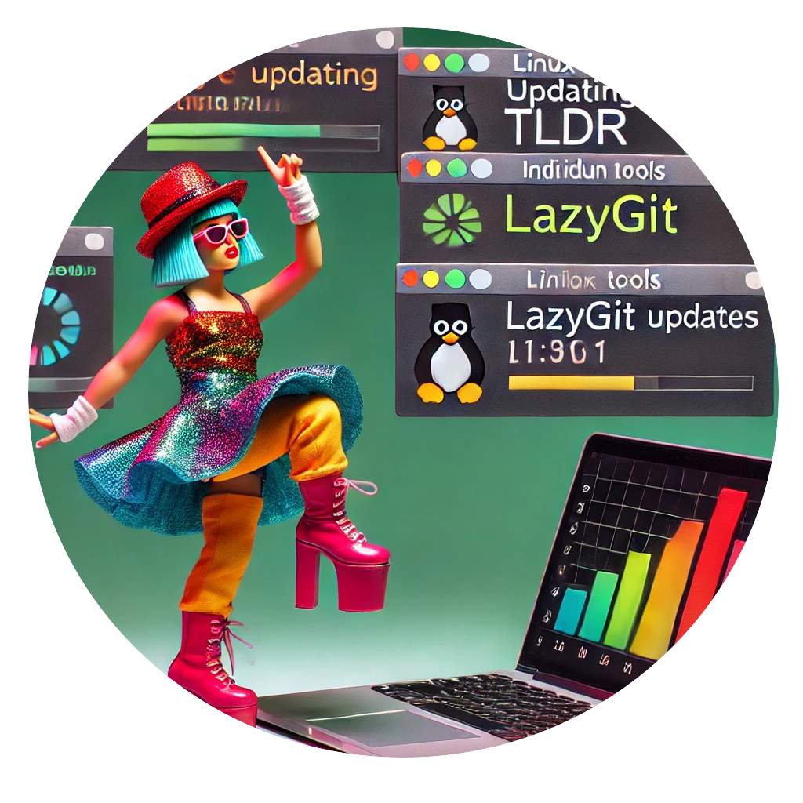

## gogo

### What does it do?


Here is why I wrote this tool: I love the idea of being able to roll out my favorite shell tools locally anywhere I need to.
This means I am a fan of self-sufficient tools, such as lazygit and others. No library dependencies, and as OS-independent as possible.
So, please **do not call this tool a package manager** as that is a non-goal.

<br clear="all">
All it does is, provided a minimal list of hints, it will download and install whatever commands I need:
- as long as there are no dependencies
- as long as they are available as packages on github

A few examples: 
- [tldr](https://github.com/isacikgoz/tldr)
- [lazygit](https://github.com/jesseduffield/lazygit)
- [lazysql](https://github.com/jorgerojas26/lazysql)
- [certinfo](https://github.com/pete911/certinfo)
- [croc](https://github.com/schollz/croc)

But also _tldr, lazysql, lazygit, croc, bit, viddy, up, fd, lsd, bat, fzf, rg, difft, certinfo, sops, age, gomuks, gotty, humanlog, jira, plow, pngsource, reflex, jq, gojq, jqp, mlr, fx, hugo, syncthing, minikube, dog, sd, navi, grex, zellij, xplr, gping, dust, dua, duf, xh, frp, rclone, etc._

### Typical workflow

First setup:

1. Download `gogo` and install it in your path
2. Create or re-use an existing configuration
3. Run `gogo fetch -config <path-to-configuration>`

Updating a single command:

1. Confirm command name using `gogo list -config <path-to-configuration>`
2. Run `goto fetch <command-name> -config <path-to-configuration> -update`

Installing missing commands:

1. Update configuration to include these commands
2. Run `gogo fetch -config <path-to-configuration>`

Refresh all commands:

1. Run `goto fetch -config <path-to-configuration> -update`

### Specifying where the commands should go

If you leave this location unspecified, these commands will be located in the same directory as this tool itself.

To specify a different location, add to your configuration file/directory:

```
[paths]
targetdir = "<path>"
```

### Where is that configuration file?

By default, it will be created in your user config directory, under `gogo`. You can specify a different location by running `gogo -config <path>`.

### Working with GitHub's rate limiter

If you are running this tool as an anonymous user, you will be able to perform up to 60 queries per hour. If should be enough for many use cases.

If you need greater API allowance, follow [this guide](https://docs.github.com/en/authentication/keeping-your-account-and-data-secure/managing-your-personal-access-tokens) to create personal access tokens. 

Note that you will need to grant your token specific repo access if you plan on getting commands from private repositories.

Store your token in the configuration file/directory:

```
[auth]
token = "github_<xxxxxxxxxx>"
```

### Development

#### Releasing

```
make && make package
export RELEASE_TAG=<semantic-tag>
git tag v$RELEASE_TAG
git push --tags
gh release create v$RELEASE_TAG
gh release upload v$RELEASE_TAG gogo-darwin-arm64 gogo-linux-amd64 config.tgz
gh release edit v$RELEASE_TAG --draft=false --latest
```

#### TODO

- Use ldd to determine who's truly standalone
- Review tags because right now they are pretty weakly picked

### FAQ

Please note that this FAQ mostly addresses issues that are out of my control.

**Q: Why am I seeing a GLIBC error when I run some binaries?**

A: This is a known issue. The binaries I fetch are built for more recent versions of glibc than the one you have. 
You can either build them yourself, or reach out to the maintainer of the project to build them for your architecture.

**Q: Why am I seeing a message about libunwind?**

A: This happens with some binaries that depend on libunwind. This is ok and the binaries are still fully functional. You can suppress this error by appending `2>/dev/null` to your shell command. This is especially helpful if you are running a curses-based tool.
